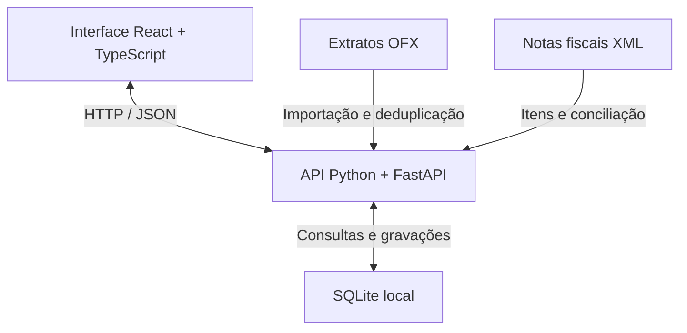

# Financeiro pessoal

### Seus extratos e suas compras, no mesmo lugar.

Aplicativo local de controle financeiro que importa extratos OFX, organiza lançamentos e vincula notas fiscais às compras. A proposta é entender tanto **quanto foi gasto** quanto **o que foi comprado**, sem registrar a mesma despesa duas vezes.

**Versão 0.3.0 · MVP acadêmico · Dados locais · Interface em português**

[Começar](#como-executar) · [Funcionalidades](#funcionalidades) · [Tecnologias](#tecnologias) · [Desenvolvimento](#desenvolvimento) · [Próximos passos](#próximos-passos)

---

## Demonstração online

A versão publicada pode ser acessada em:

**https://financeiro-pessoal-demo.onrender.com**

Para a apresentação, use:

- **Usuário:** `demo`
- **Senha:** `Denarius123@4567`

Essa é uma conta compartilhada da demonstração, com dados fictícios. O acesso é destinado à apresentação do MVP; não importe extratos ou notas pessoais nessa versão.

## A ideia

O extrato bancário mostra uma compra de **R$ 252,91** no mercado. A nota mostra arroz, carne, produtos de limpeza e os demais itens. O sistema aproxima essas duas informações: importa a movimentação financeira e permite vincular o XML da nota à compra correspondente.

**A nota detalha o lançamento. O valor da compra entra apenas uma vez nos totais.**

O projeto foi organizado em três entregas: primeiro o núcleo de importação e consulta; depois saldos e gestão dos dados; por fim, temas e relatórios. Esta versão reúne as três etapas em uma base que pode continuar sendo ampliada.

## Funcionalidades

| Área | O que é possível fazer |
| --- | --- |
| **Visão geral** | Consultar entradas, despesas, resultado mensal, categorias e pendências. |
| **Lançamentos** | Pesquisar, filtrar por mês, banco e categoria, cadastrar movimentos e ajustar classificação e observações. |
| **Importações** | Importar OFX de conta e cartão, conferir uma prévia e consultar o histórico. |
| **Duplicidade** | Reconhecer lançamentos já importados e revisar possíveis duplicatas. |
| **Notas de compra** | Importar XML de NF-e/NFC-e, consultar produtos, classificar itens e vincular a nota a uma despesa. |
| **Saldos** | Consultar saldos contábil e disponível presentes no OFX, com data de referência, ou informar um saldo manualmente. |
| **Gestão dos dados** | Excluir lançamentos, restaurar pela lixeira e limpar lançamentos ou toda a base com backup preventivo. |
| **Relatórios** | Visualizar despesas por categoria e comparar entradas e despesas de até seis meses com movimentação. |
| **Exportação** | Baixar relatório em PNG, exportar lançamentos em CSV e usar a impressão do navegador para salvar em PDF. |
| **Aparência** | Alternar entre tema claro, escuro e do sistema, com a preferência salva no navegador. |

## Tecnologias

| Tecnologia | Uso no projeto |
| --- | --- |
| **React** | Construção das telas e dos componentes da interface. |
| **TypeScript** | Tipagem do frontend e verificação de erros durante o desenvolvimento. |
| **CSS** | Layout, adaptação a diferentes tamanhos de tela e temas claro/escuro. |
| **Vite** | Servidor de desenvolvimento e compilação do frontend. |
| **Python** | Leitura dos arquivos, processamento dos dados e regras do sistema. |
| **FastAPI** | API HTTP que conecta a interface às operações do backend. |
| **Pydantic** | Validação dos dados recebidos pela API. |
| **SQLite** | Banco relacional armazenado em um arquivo local. |
| **SVG e Canvas** | Desenho dos gráficos e geração do relatório em PNG. |
| **Lucide React** | Ícones da interface. |
| **pytest e TestClient** | Testes automatizados das regras e dos fluxos da API. |

**Formatos utilizados:** OFX para extratos, XML para notas fiscais, JSON na comunicação com a API e CSV para exportar lançamentos.

O Node.js é utilizado pelas ferramentas de desenvolvimento do frontend. Na execução do pacote já compilado, o servidor é Python.

## Como funciona



No uso normal, o FastAPI entrega a interface compilada e atende às requisições da aplicação. Tudo roda no próprio computador, em `127.0.0.1`. Durante o desenvolvimento, o Vite serve a interface separadamente e encaminha as chamadas da API ao backend.

## Como executar

### Pelo ZIP, com a interface pronta

**Requisito:** Python 3.11 ou superior. A primeira execução precisa de internet para instalar as dependências.

1. Extraia a pasta inteira do projeto.
2. No Windows, abra **`iniciar.bat`** ou execute, na raiz do projeto:

   ```powershell
   py -3 iniciar.py
   ```

3. Aguarde a preparação do ambiente. O navegador será aberto em **http://127.0.0.1:8765**.

O iniciador cria o ambiente virtual `.venv`, instala as dependências e inicia o servidor. Mantenha o terminal aberto enquanto usa o aplicativo; pressione `Ctrl+C` para encerrar.

No Linux ou macOS, use `python3 iniciar.py`. Algumas distribuições Linux exigem a instalação de `python3-venv`.

### Pelo código do repositório

Além do Python, use **Node.js 22.12+ ou 24+**, com npm. A pasta `frontend/dist` é gerada pela compilação e está no `.gitignore`; por isso, precisa ser criada depois de clonar ou baixar o código do GitHub.

Na raiz do projeto:

```powershell
cd frontend
npm ci
npm run build
cd ..
py -3 iniciar.py
```

No Linux/macOS, substitua o último comando por `python3 iniciar.py`.

## Experimentar com os exemplos

Em uma base vazia, clique em **Usar dados de exemplo**. O aplicativo carrega 24 movimentações fictícias de agosto e setembro de 2026 e uma nota com 12 produtos.

Selecione **setembro de 2026** para acompanhar o fluxo:

1. Consulte o resumo do mês.
2. Em **Notas de compra**, vincule a nota do Mercado Bom Dia à despesa de **R$ 252,91**, de **09/09/2026**.
3. Volte ao resumo e confira que as despesas continuam iguais.
4. Em **Importações**, reimporte os OFX da pasta `exemplos/` para demonstrar a deduplicação.
5. Alterne o tema e abra **Relatórios** para exportar o resultado.

| Indicador de setembro nos exemplos | Valor |
| --- | ---: |
| Entradas | R$ 3.850,00 |
| Despesas | R$ 1.985,41 |
| Resultado do mês | R$ 1.864,59 |

Esses valores correspondem à base de exemplo sem alterações. O [roteiro de apresentação](docs/APRESENTACAO.md) detalha a demonstração.

## Regras que orientam os cálculos

- **Valores em centavos inteiros:** evita imprecisões de ponto flutuante nos cálculos monetários.
- **Reimportação sem duplicação:** o identificador bancário `FITID` é considerado no contexto da conta. Um identificador repetido com dados conflitantes faz o arquivo ser rejeitado para conferência.
- **Revisão quando houver dúvida:** coincidências sem identificação suficiente ficam como possíveis duplicatas, fora dos totais até a confirmação.
- **Conciliação de notas:** exige despesa confirmada, valor igual, diferença de até três dias e soma dos itens compatível com o total da nota. O estabelecimento deve ser conferido pelo usuário. Há um vínculo por nota e por lançamento.
- **Resultado mensal:** considera entradas menos despesas. Transferências, investimentos e ajustes ficam fora desse resultado.
- **Saldo bancário:** representa o valor informado no extrato ou cadastrado manualmente, com sua data. Não é recalculado ao excluir um lançamento, e saldos de cartões ficam fora do total das contas.

Quando as compras do cartão e o pagamento da fatura estiverem importados, classifique o pagamento da fatura como **transferência** para evitar contabilizar o gasto novamente.

Os gráficos por categoria usam a categoria do **lançamento**. A classificação de cada **produto** permanece no detalhamento da nota. O CSV pode incluir possíveis duplicatas, identificadas pela coluna de revisão; elas continuam fora dos totais dos gráficos.

## Desenvolvimento

Os comandos abaixo usam PowerShell e partem da raiz do projeto. Não é necessário ativar o ambiente virtual: os comandos chamam diretamente seu executável.

Prepare o backend:

```powershell
py -3 -m venv .venv
.venv\Scripts\python -m pip install -r backend\requirements-dev.txt
```

Em um terminal, inicie a API:

```powershell
cd backend
..\.venv\Scripts\python -m uvicorn app.main:app --host 127.0.0.1 --port 8765 --reload
```

Em outro terminal, a partir da raiz, inicie a interface:

```powershell
cd frontend
npm ci
npm run dev
```

Abra **http://127.0.0.1:5173**. Não execute `iniciar.bat` junto com esse fluxo: a API já estará usando a porta 8765.

Após alterar a interface, execute `npm run build` dentro de `frontend` para atualizar a versão utilizada pelo iniciador.

No Linux/macOS, crie o ambiente com `python3 -m venv .venv`, use `.venv/bin/python` e ajuste os caminhos dos comandos.

## Organização do código

| Caminho | Responsabilidade |
| --- | --- |
| `backend/app/main.py` | Rotas da API e operações principais. |
| `backend/app/ofx.py` | Leitura e normalização dos extratos OFX. |
| `backend/app/imports.py` | Prévia, deduplicação e gravação das importações. |
| `backend/app/receipts.py` | Leitura das notas fiscais XML. |
| `backend/app/domain.py` | Datas, valores, categorias e regras iniciais de classificação. |
| `backend/app/management.py` | Saldos, lixeira e limpeza dos dados. |
| `backend/app/db.py` | Conexão com o SQLite e inicialização da base. |
| `backend/app/schema.sql` e `migration_002.sql` | Estrutura inicial e migração do banco. |
| `backend/tests/` | Testes das regras e dos fluxos da API. |
| `frontend/src/pages/` | Telas da aplicação, incluindo os relatórios. |
| `frontend/src/api.ts` | Comunicação com a API e formatação de dados. |
| `frontend/src/theme.ts` | Seleção e persistência do tema no navegador. |
| `frontend/src/styles.css` e `themes.css` | Estilos, tema escuro e impressão. |
| `exemplos/` | Extratos e nota fiscal fictícios para demonstração. |
| `docs/` | Arquitetura, roteiro de apresentação e registro de validação. |
| `iniciar.py` e `iniciar.bat` | Preparação do ambiente e inicialização local. |

## Testes e validação

Com as dependências de desenvolvimento instaladas, execute na raiz:

```powershell
.venv\Scripts\python -m pytest -q
```

Para verificar os tipos e compilar a interface:

```powershell
cd frontend
npm run build
```

A entrega **0.3.0** foi validada com **30 testes automatizados aprovados** e compilação do frontend. Os testes usam bases temporárias e cobrem importação, duplicidade, valores, conciliação, saldos, migração, exclusão, restauração, backup e CSV.

A conferência interativa de tema, download PNG e impressão/PDF ficou pendente no ambiente de entrega. Os passos para realizá-la estão em [Validação](docs/VALIDACAO.md).

## Dados, exclusão e backup

Por padrão, o banco fica em **`data/financeiro.sqlite3`**, incluindo os arquivos originais retidos nas importações. A opção **Fazer backup** baixa uma cópia do banco. O CSV é uma exportação de consulta e não substitui esse backup.

| Operação | Efeito |
| --- | --- |
| Excluir um lançamento | Move para a lixeira; pode ser restaurado pela interface. Se houver nota vinculada, desvincule primeiro. |
| Apagar todos os lançamentos | Remove também a lixeira e o histórico de importações. Preserva notas e saldos, mas desfaz os vínculos das notas. Permite reimportar os OFX. |
| Apagar toda a base | Remove lançamentos, importações, notas, produtos, contas e saldos. |

As duas limpezas em lote exigem confirmação e criam um backup em `data/backups` antes de apagar. Se o backup falhar, a limpeza é cancelada. A recuperação dessas limpezas é feita pelo arquivo de backup.

**Para restaurar um backup:** feche o aplicativo, guarde uma cópia do banco atual e copie o backup para a pasta de dados com o nome `financeiro.sqlite3`. Depois, abra o aplicativo novamente.

Para usar uma pasta separada em uma demonstração, execute na raiz, no PowerShell:

```powershell
$env:FINANCEIRO_DATA_DIR = "$PWD\data-demonstracao"
py -3 iniciar.py
```

A variável vale para esse terminal; backups e banco passam a usar a pasta escolhida. A preferência de tema continua no navegador.

O MVP foi feito para uso individual e local, sem autenticação ou criptografia própria do banco. Bancos de dados, backups e extratos pessoais devem ficar fora do Git; o repositório inclui somente arquivos fictícios de exemplo.

## Limites da versão

O importador atende ao subconjunto implementado de **OFX 1.x/2.x de contas e cartões em BRL**. Extratos de bancos diferentes ainda precisam de validação com arquivos reais. OFX de investimentos, correções bancárias e conversão cambial não são suportados.

As notas são lidas por XML. Não há leitura de fotos, PDF ou QR Code, consulta à SEFAZ ou verificação de assinatura fiscal. Também não há integração direta com bancos, parcelamento automático ou gestão de carteira de investimentos. O tipo de lançamento “investimento” é apenas uma classificação nesta versão.

A edição atual permite alterar tipo, categoria e observação. Data, descrição e valor permanecem como cadastrados. Pagamentos divididos e múltiplas notas vinculadas a uma mesma compra ficam fora deste recorte.

## Próximos passos

- [ ] Validar a importação com extratos reais de mais bancos.
- [ ] Ampliar a edição de lançamentos manuais e registrar alterações.
- [ ] Permitir regras de classificação criadas pelo usuário.
- [ ] Adicionar parcelamento e conciliação entre saldos e movimentações.
- [ ] Criar relatórios por produto e histórico de preços.
- [ ] Implementar leitura de imagens/PDF com OCR e revisão antes de salvar.

## Documentação

- [Primeiros passos e atualização](COMECE_AQUI.md)
- [Arquitetura e decisões técnicas](docs/ARQUITETURA.md)
- [Roteiro de apresentação](docs/APRESENTACAO.md)
- [Testes e conferência local](docs/VALIDACAO.md)

---
Disponibilização de vídeo de apresentação do sistema: https://youtu.be/MKi6YaN11TM
Desenvolvido como projeto acadêmico para demonstrar importação de dados, persistência local, organização financeira e integração entre frontend e backend.
