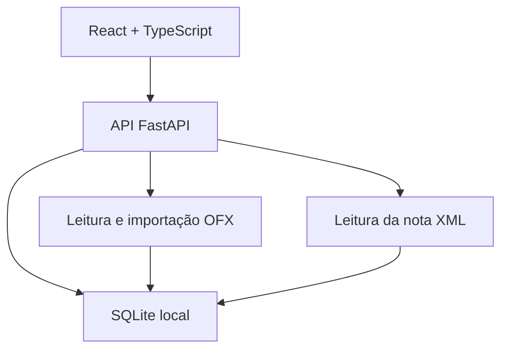
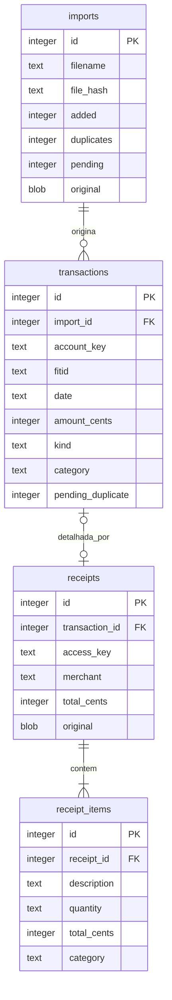

# Notas de desenvolvimento

## Estrutura

O navegador conversa com a API local. Em uso normal, o FastAPI também entrega os arquivos compilados da interface, então só um processo precisa ficar aberto. Durante o desenvolvimento, o Vite roda separadamente e encaminha as chamadas da API.

As regras iniciais são pequenas funções em `domain.py`. Elas sugerem uma categoria a partir da descrição. A correção manual atualiza apenas o lançamento escolhido; não cria uma regra nova.

## Banco

A restrição `UNIQUE(account_key, fitid)` só se aplica quando existe `FITID`. O vínculo de uma nota também é único por lançamento. Chaves estrangeiras são ativadas em toda conexão.

`amount_cents` guarda valores com sinal: entrada positiva e saída negativa. `kind` decide se um registro entra no resumo. O sinal e o tipo são validados na API. Quantidade de produto fica em texto decimal, para preservar produtos vendidos por peso.

O esquema está na versão 2, identificada por `PRAGMA user_version`. `schema.sql` cria a base inicial e `migration_002.sql` adiciona `accounts` (contas identificadas pelo mesmo hash usado nos lançamentos) e `balance_snapshots` (saldo, tipo, data e origem). A inicialização aplica apenas as migrações pendentes, preservando os dados da parte 1. Não foi incluído Alembic.

## Saldos e exclusão

`LEDGERBAL` e `AVAILBAL` são guardados separadamente. A tela usa a maior data de referência por conta e tipo; no empate, o registro mais recente. O total soma somente saldos contábeis de contas, excluindo cartões. Saldos não são somados aos lançamentos nem recalculados quando um lançamento é excluído: representam o valor informado naquela data.

A exclusão individual marca `active=0`. A lixeira permite restaurar o registro e a reimportação mantém a deduplicação. Uma nota vinculada precisa ser desvinculada antes de excluir seu lançamento.

A limpeza em lote exige a palavra APAGAR. Dentro de uma transação com trava de escrita, outra conexão faz o backup do estado anterior usando a API do SQLite. Só depois são apagados os registros; uma falha no backup impede a limpeza. A opção de limpar lançamentos também limpa o histórico de importações e os vínculos das notas, permitindo uma nova importação. A opção de limpar toda a base remove ainda notas, itens, contas e saldos. A recuperação em lote é manual pelo arquivo de backup.

## Importação

1. A API limita o arquivo a 5 MB e valida a extensão e o conteúdo.
2. O leitor identifica conta/cartão e extrai data, valor, descrição e identificador.
3. A prévia consulta a base e marca cada linha como nova, já existente ou pendente.
4. Ao confirmar, o plano é recalculado dentro de uma transação `BEGIN IMMEDIATE`.
5. O lote e os novos registros são gravados juntos. Erro no arquivo faz a operação voltar atrás.

Cada arquivo selecionado é uma operação independente. Se um arquivo falhar, a interface mostra o erro e mantém o resultado dos demais. Isso permite reimportar somente o arquivo corrigido.

O resumo da importação separa **novos confirmados**, **existentes** e **pendentes**. Pendentes estão armazenados, mas ainda não participam dos totais.

O parser suporta o subconjunto de extratos esperado para este MVP; não é um validador completo da especificação OFX. Ele rejeita moeda diferente de BRL, correções bancárias, OFX de investimentos e agregados incompletos. Para novos bancos, o próximo passo é adicionar fixtures anônimas e adaptadores específicos.

## Notas e conciliação

O XML é lido com `defusedxml`, sem entidades externas. A nota e seus produtos são gravados separadamente dos lançamentos. A chave de acesso e o hash do arquivo evitam o cadastro repetido.

Os candidatos usam valor exato e janela de três dias. O usuário confere o estabelecimento e escolhe a compra. A API refaz as validações no vínculo; não confia apenas na escolha da interface. Alterar um lançamento vinculado para transferência exige primeiro desvincular a nota.

O resumo é calculado somente a partir de `transactions`. Não há soma entre transações e itens de nota. Um relatório futuro por produtos deverá usar os itens das notas vinculadas como decomposição do gasto, respeitando essa mesma regra.

Quando o XML contém diferenças fiscais não distribuídas nos itens, a nota pode ser guardada para conferência, mas o vínculo fica bloqueado. A interface não edita valores fiscais nesta versão.

## Execução local

O iniciador usa o endereço de loopback, `127.0.0.1`. Há validação de host, origem das requisições, tamanho de upload e campos da API. Não há autenticação nem proteção para uso como serviço público; esse não é o destino desta versão.

Valores de SQL entram como parâmetros. A interface não usa HTML vindo dos arquivos. O CSV protege campos textuais que poderiam ser interpretados como fórmulas por uma planilha. Os arquivos originais ficam como BLOB no SQLite, evitando nomes de arquivos externos usados como caminhos de gravação.

O backup usa a API de backup do SQLite, criando uma cópia consistente. Restauração, criptografia e gestão de usuários ficam fora do escopo atual.

## Tema e relatórios (parte 3)

`theme.ts` salva a preferência em `localStorage` e aplica `data-theme` ao documento. A opção Sistema observa mudanças em `prefers-color-scheme`. Se o armazenamento estiver bloqueado, a troca ainda funciona na sessão. `themes.css` mantém o visual claro e acrescenta as cores escuras, sem mudar as regras financeiras.

`Reports.tsx` usa a mesma API de resumo da visão geral. O gráfico é SVG, com textos e valores explícitos; o download converte esse SVG em PNG usando Canvas em resolução dupla. A impressão usa uma folha A4 clara. Não há serviço externo nem biblioteca adicional de gráficos. O CSV aceita `month=AAAA-MM`; sem o parâmetro, preserva a exportação de todos os lançamentos ativos. Possíveis duplicatas permanecem identificadas no CSV e fora dos totais dos gráficos.

## Como ampliar

Para OCR, adicione um leitor que produza a mesma estrutura usada pelo leitor XML, mas inclua uma etapa de correção antes de gravar. Para um novo banco, concentre a adaptação no leitor OFX e preserve a identidade das contas já importadas. Para novos relatórios, use consultas separadas sem alterar o significado dos lançamentos.

A divisão atual foi escolhida para o projeto continuar pequeno e compreensível. Se as rotas crescerem, o primeiro refactor é separar `main.py` em routers de lançamentos, importações e notas, mantendo os serviços de leitura independentes.
